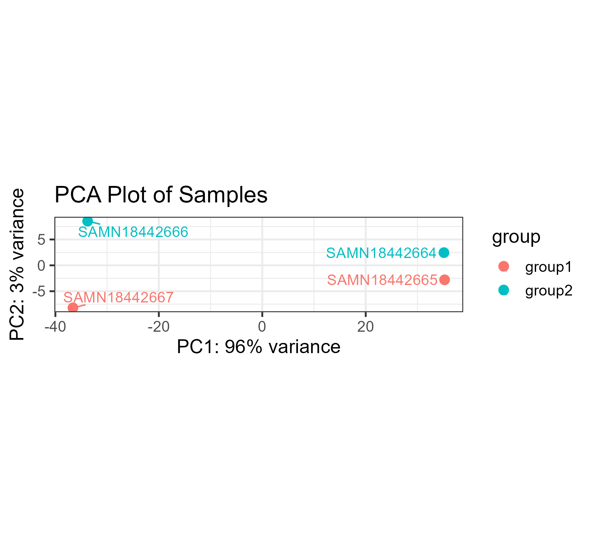
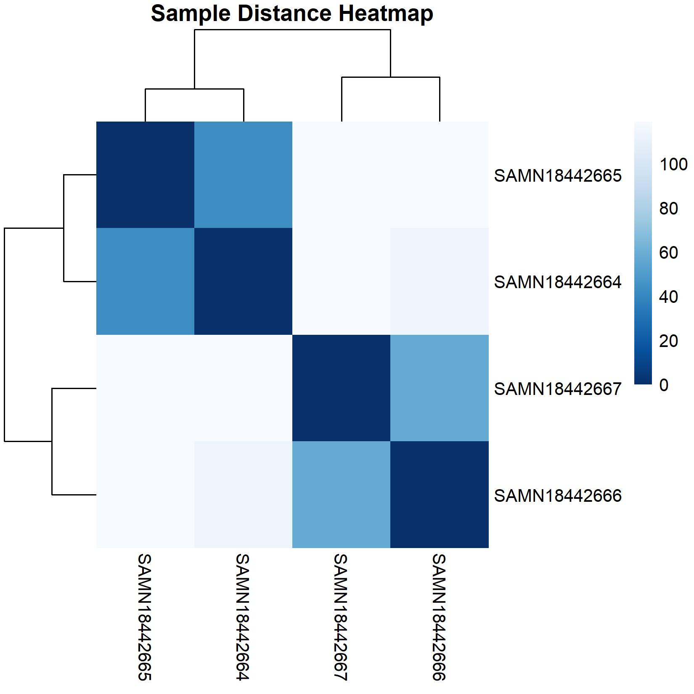
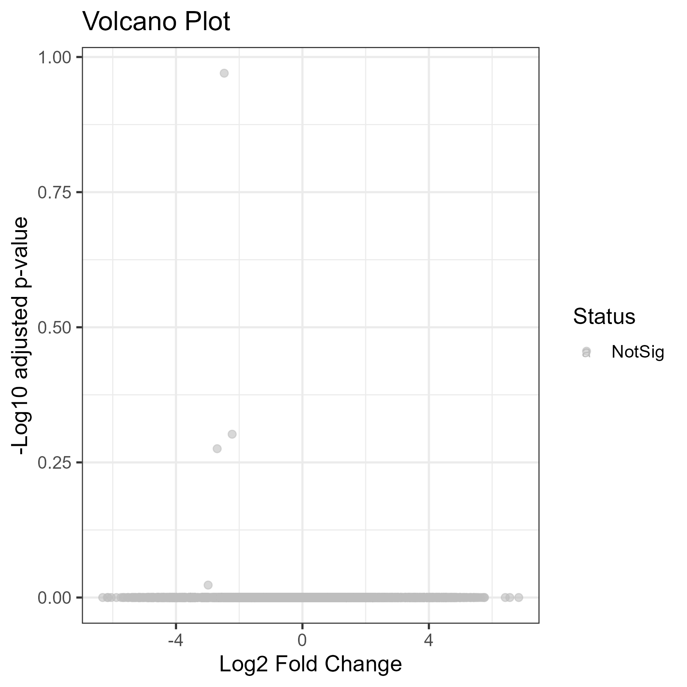
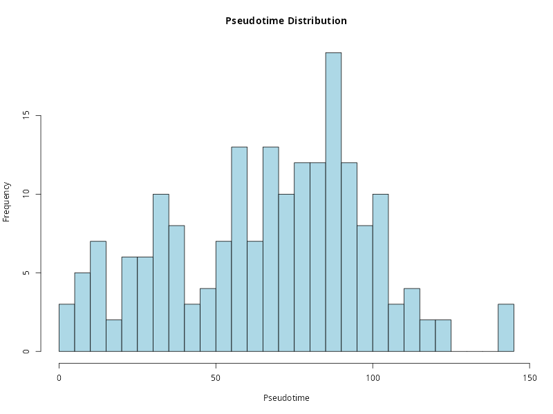
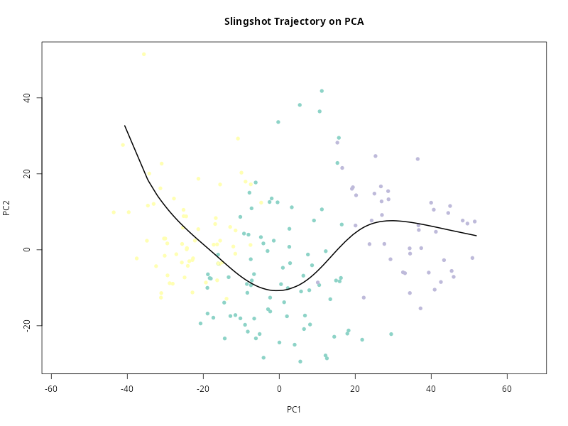
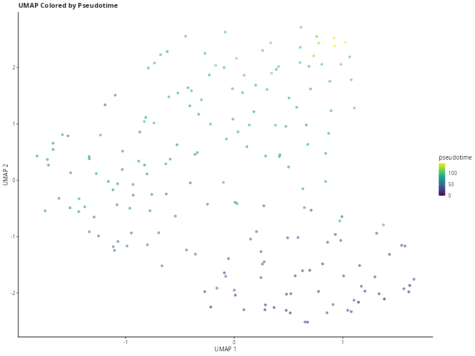
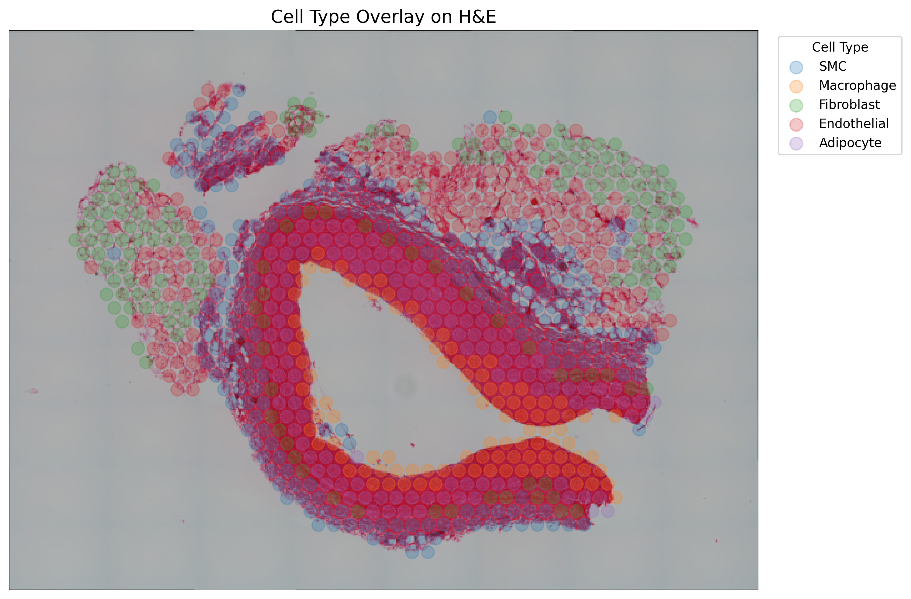
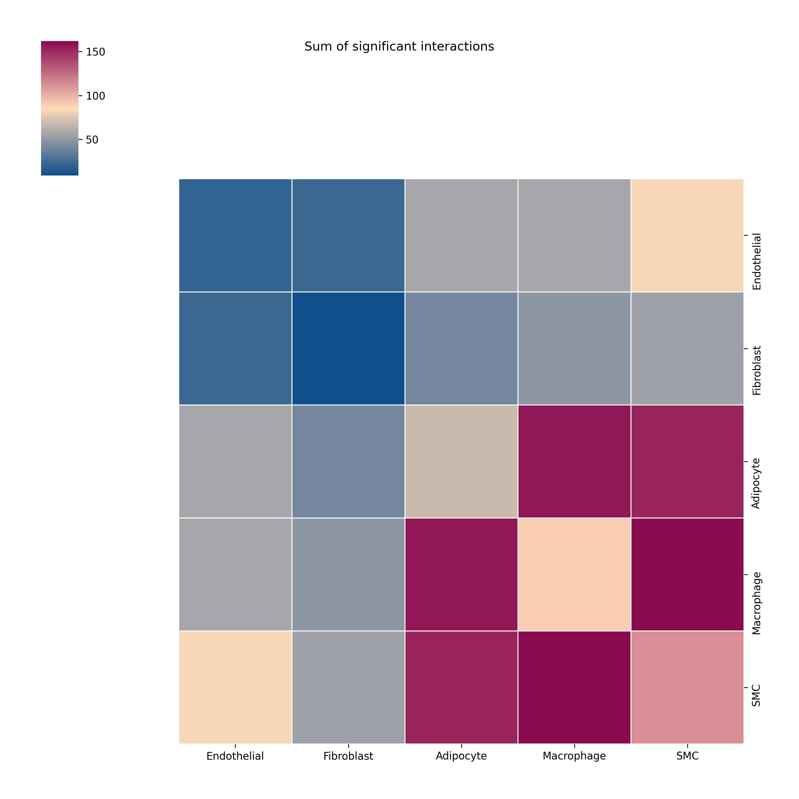

# Test Run: RNA‑seq, Single‑Cell Trajectory & Cell-Cell Communication Analysis 
[](https://opensource.org/licenses/MIT)

_A modular, HPC‑compatible suite of workflows demonstrating bulk RNA‑seq, single‑cell Slingshot trajectory inference, and Visium‑based spatial transcriptomics with CellPhoneDB._

---

## 1. Introduction

This repository implements end‑to‑end bioinformatics pipelines on an HPC environment to showcase expertise in:

1. **Bulk RNA‑seq**: alignment → quantification → differential expression → GO enrichment  
2. **Trajectory analysis**: normalization → PCA/UMAP → clustering → Slingshot trajectory → pseudotime  
3. **Cell-Cell Communication**: Visium data import → clustering → cell‑type annotation → CellPhoneDB ligand–receptor analysis  

**Tools & Languages**  
- **CLI**: SRA Toolkit, HISAT2, SAMtools, Subread/featureCounts, FastQC, MultiQC  
- **R**: DESeq2, clusterProfiler, scater, scran, slingshot, ggplot2, pheatmap  
- **Python**: Scanpy, CellPhoneDB, ktplotspy, matplotlib, pandas, numpy  

---
## 2. Required tools and applications

#### 2.1 Install sratoolkit

```bash
wget https://ftp-trace.ncbi.nlm.nih.gov/sra/sdk/3.2.1/sratoolkit.3.2.1-ubuntu64.tar.gz
tar -xvzf sratoolkit.current-ubuntu64.tar.gz
cd sratoolkit.*
export PATH=$PATH:$(pwd)/bin
```

#### 2.2. Install hisat2

```bash
wget https://cloud.biohpc.swmed.edu/index.php/s/oTtGWbWjaxsQ2Ho/download
unzip hisat2-2.2.0-Linux.zip
cd hisat2-2.2.0
export PATH=$PATH:$(pwd)
hisat2 --version
```

#### 2.3. Install Subread

```bash
wget https://sourceforge.net/projects/subread/files/subread-2.1.0/subread-2.1.0-Linux-x86_64.tar.gz
tar -xvzf subread-2.1.0-Linux-x86_64.tar.gz
cd subread-2.1.0-Linux-x86_64
export PATH=$PATH:$(pwd)/bin
```

## 3. Q1 Bulk RNA‑seq Analysis

A modular and reproducible pipeline for RNA-seq data analysis, designed to be deployed on high-performance computing environments with customizable R installations.

### 3.1. Overview

The pipeline supports:
- Alignment of RNA-seq reads to a reference genome
- Gene-level quantification
- Differential gene expression analysis using the DESeq2 package

### 3.2. Step-by-step instructions to fetch data and perform Differential Expression & Gene Ontology

#### 3.2.1. Source the environment setup script

```bash
source ./Tools/load_paths_and_test_tools.sh
```

#### 3.2.2. Prep R

```bash
set_r_version 4.3.2
export LD_LIBRARY_PATH=/gpfs/fs7/aafc/phenocart/PhenomicsProjects/UFPSGPSCProject/4_Assets/R/icu/lib:$LD_LIBRARY_PATH
Rscript --version
```
#### 3.2.3. Fetch data
https://www.ncbi.nlm.nih.gov/bioproject/?term=PRJNA716327

```bash
prefetch SRR14055933 --output-directory .
prefetch SRR14055935 --output-directory .
prefetch SRR14055934 --output-directory .
prefetch SRR14055936 --output-directory .
```
#### 3.2.4. Convert SRA to FASTQ

```bash
fasterq-dump SAMN18442667
fasterq-dump SAMN18442665
fasterq-dump SAMN18442666
fasterq-dump SAMN18442664
```

#### 3.2.5. Steps to Build HISAT2 Index for mm39 (GRCm39)

```bash
wget ftp://ftp.ensembl.org/pub/release-111/fasta/mus_musculus/dna/Mus_musculus.GRCm39.dna.primary_assembly.fa.gz
gunzip Mus_musculus.GRCm39.dna.primary_assembly.fa.gz
mkdir -p mm39_index
hisat2-build Mus_musculus.GRCm39.dna.primary_assembly.fa mm39_index/mm39
```

#### 3.2.6. Align them to the reference genome

```bash
hisat2 -x mm39_index/mm39 -1 SAMN18442667_1.fastq -2 SAMN18442667_2.fastq -S SAMN18442667.sam
hisat2 -x mm39_index/mm39 -1 SAMN18442665_1.fastq -2 SAMN18442665_2.fastq -S SAMN18442665.sam
hisat2 -x mm39_index/mm39 -1 SAMN18442666_1.fastq -2 SAMN18442666_2.fastq -S SAMN18442666.sam
hisat2 -x mm39_index/mm39 -1 SAMN18442664_1.fastq -2 SAMN18442664_2.fastq -S SAMN18442664.sam
```
- **Alignment rate:** > 95% → no trimming needed  

#### 3.2.7. Convert SAM to BAM

```bash
samtools view -bS SAMN18442667.sam | samtools sort -o SAMN18442667.sorted.bam
samtools index SAMN18442667.sorted.bam
samtools view -bS SAMN18442665.sam | samtools sort -o SAMN18442665.sorted.bam
samtools index SAMN18442665.sorted.bam
samtools view -bS SAMN18442666.sam | samtools sort -o SAMN18442666.sorted.bam
samtools index SAMN18442666.sorted.bam
samtools view -bS SAMN18442664.sam | samtools sort -o SAMN18442664.sorted.bam
samtools index SAMN18442664.sorted.bam
```

#### 3.2.8. Download genome build

```bash
wget https://ftp.ebi.ac.uk/pub/databases/gencode/Gencode_mouse/release_M33/gencode.vM33.annotation.gtf.gz
gunzip gencode.vM33.annotation.gtf.gz
```

#### 3.2.9. Generate count matrix

```bash
featureCounts -p -T 8 -t exon -g gene_id -a annotation.gtf -o counts.txt *.sorted.bam
```
#### 3.2.10. Run the Script

```bash
Rscript 01_Bulk_RNASeq/Bulk_RNA-Seq(r_code).R
```

### 3.3. R code Analysis Overview  
1. Load raw counts (`count_data.csv`) and sample metadata (`col_data.csv`).  
2. Build a `DESeqDataSet` with `design = ~ group` (levels: group1, group2).  
3. Run DESeq2 to estimate size factors, dispersions, and test for differential expression.  
4. Apply filtering:  
   - Adjusted p‑value < 0.05  
   - |log₂ fold change| > 1  

---

### 3.4. Key Results  
- **Total genes tested:** 56,885  
- **DEGs (padj < 0.05 & |log₂FC| > 1):** 0  _→_ no genes passed the thresholds.  
- **GO BP enrichment:** no DEGs to analyze; but corresponding code available `01_Bulk_RNASeq/Bulk_RNA-Seq(r_code).R`

---

### 3.5. QC & Diagnostic Plots  

#### 3.5.1. PCA Plot  
  
> Principal component analysis of variance‑stabilized counts.  
> PC1 (96% variance) separates group1 vs group2; PC2 accounts for ~3%.

#### 3.5.2. Sample‑to‑Sample Distance Heatmap  
  
> Euclidean distances between samples (VST counts), clustered by similarity. group1 and group2 each form tight clusters.

#### 3.5.3. Volcano Plot  
  
> Log₂ fold change vs –log₁₀ adjusted p‑value. No points exceed the significance/FDR and fold‑change thresholds.

---

### 3.6. Conclusions  
- At padj < 0.05 and |log₂FC| > 1, no genes are differentially expressed between group1 and group2 under these conditions.  
- Accordingly, GO Biological Process enrichment was not performed but corresponding code available.  

> **Note:** The complete R script driving this analysis (data import, DESeq2 workflow, filtering, plotting, and GO enrichment steps) is included in  
> `01_Bulk_RNASeq/Bulk_RNA-Seq(r_code).R`.  

## 4. Q2 Trajectory Analysis

### 4.1. Step-by-step instructions to fetch data and perform Trajectory Analysis

#### 4.1.1. Source the environment setup script

```bash
source ./Tools/load_paths_and_test_tools.sh
```

#### 4.1.2. Prep R

```bash
set_r_version 4.3.2
export LD_LIBRARY_PATH=/gpfs/fs7/aafc/phenocart/PhenomicsProjects/UFPSGPSCProject/4_Assets/R/icu/lib:$LD_LIBRARY_PATH
Rscript --version
```

#### 4.1.3. Fetch raw SRA data

```bash
mkdir -p data/raw_sra
cd data/raw_sra

while read SRR; do
  echo "Prefetching $SRR"
  prefetch --output-directory . "$SRR"
done < ../../data/raw_sra/sra_list.txt
```

#### 4.1.4. Extract fastq

```bash
mkdir -p data/raw_sra
cd data/raw_sra

while read SRR; do
  echo "Prefetching $SRR"
  prefetch --output-directory . "$SRR"
done < ../../data/raw_sra/sra_list.txt
```

#### 4.1.5. Quality control

```bash
mkdir -p data/qc/fastqc
fastqc data/fastq/*_2.fastq -o data/qc/fastqc

dcd data/qc/fastqc
multiqc . -o ../multiqc
```

#### 4.1.6. Build reference & Index

```bash
mkdir -p data/reference
cd data/reference

# Genome FASTA and GTF annotation
gwget ftp://ftp.ensembl.org/pub/release-110/fasta/mus_musculus/dna/Mus_musculus.GRCm39.dna.primary_assembly.fa.gz
gunzip Mus_musculus.GRCm39.dna.primary_assembly.fa.gz
wget ftp://ftp.ensembl.org/pub/release-110/gtf/mus_musculus/Mus_musculus.GRCm39.110.gtf.gz
gunzip Mus_musculus.GRCm39.110.gtf.gz

# Build HISAT2 index
mkdir -p ../hisat2_index
hisat2-build \
  Mus_musculus.GRCm39.dna.primary_assembly.fa \
  ../hisat2_index/mouse_index
```

#### 4.1.7. Align reads

```bash
mkdir -p data/reference
cd data/reference

# Genome FASTA and GTF annotation
gwget ftp://ftp.ensembl.org/pub/release-110/fasta/mus_musculus/dna/Mus_musculus.GRCm39.dna.primary_assembly.fa.gz
gunzip Mus_musculus.GRCm39.dna.primary_assembly.fa.gz
wget ftp://ftp.ensembl.org/pub/release-110/gtf/mus_musculus/Mus_musculus.GRCm39.110.gtf.gz
gunzip Mus_musculus.GRCm39.110.gtf.gz

# Build HISAT2 index
mkdir -p ../hisat2_index
hisat2-build \
  Mus_musculus.GRCm39.dna.primary_assembly.fa \
  ../hisat2_index/mouse_index
```
- **Alignment rate:** > 85% → no trimming needed

#### 4.1.8. Generate count matrix

```bash
mkdir -p data/counts
featureCounts -T 8 \
  -a data/reference/Mus_musculus.GRCm39.110.gtf \
  -o data/counts/feature_counts.txt \
  data/alignments/*_sorted.bam
```

#### 4.1.9. Run the Script

```bash
Rscript 02_trajectory_analysis/Trajectory_analysis_code.R
```

### 4.2. R code Analysis Overview

Started from a cleaned gene × cell count matrix (`cleaned_counts.csv`) and perform:

1. **Normalization**  
   Create a `SingleCellExperiment` with raw counts, then compute log‑normalized counts via `scater::logNormCounts()`.
2. **Dimensionality reduction**  
   - **PCA** (`runPCA`, 50 components)  
   - **UMAP** on PCA space (`runUMAP`)
3. **Clustering**  
   Compute clusters in PCA space with `scran::clusterCells()`.
4. **Trajectory inference**  
   Run `slingshot()` on PCA to infer developmental lineages.
5. **Pseudotime extraction**  
   Pull pseudotime along the first lineage and save to `pseudotime_values_slingshot.csv`.
6. **Plotting** (all saved as PNG via `ragg`):  
   - Pseudotime histogram  
   - PCA + trajectory  
   - UMAP colored by pseudotime  

---

### 4.3. Key Metrics

- **Cells analyzed:** 191 (quality check passed) 
- **Clusters inferred:** 3  
- **Pseudotime range:** 0 (earliest) → ~145 (latest)  

---

### 4.4. QC & Diagnostic Plots

#### 4.4.1. Pseudotime Distribution  
  
> Histogram of Slingshot pseudotime values for all cells. The x‑axis shows pseudotime (0 = earliest, ~140 = latest), and the y‑axis shows cell counts per bin, illustrating that cells are evenly distributed along the inferred trajectory.

#### 4.4.2. Slingshot Trajectory on PCA  
  
> Scatterplot of PC1 vs PC2, colored by cluster assignment (Set3 palette), with the Slingshot‑inferred developmental trajectory overlaid as a black curve tracing progression from progenitor to mature states.

#### 4.4.3. UMAP Colored by Pseudotime  
  
> UMAP embedding of all cells, colored on a continuous blue–yellow scale by their Slingshot pseudotime values. Early cells (blue) transition smoothly through intermediate (green) to late pseudotime (yellow), confirming continuity of the trajectory.

---

### 4.5. Conclusion

- Even pseudotime spread across ~0–145 units suggests robust lineage coverage.  
- Three clusters correspond to distinct transcriptional states along this trajectory.  
- PCA vs. UMAP both separate early vs late cells, validating the inferred path.  

> **Full code:** See `02_trajectory_analysis/Trajectory_analysis_code.R` for the complete Slingshot workflow including package setup, data loading, normalization, DR, clustering, trajectory inference, pseudotime extraction, and plotting.  


## 5. Q3 Spatial Transcriptomics & Cell-Cell Communication

A streamlined and modular pipeline for analyzing spatial transcriptomics data with cluster-based cell type annotation and downstream ligand–receptor interaction analysis, suitable for deployment on HPC environments and reproducible research workflows.

### 5.1. Overview

- **GEO series:** GSE283269 (10x Visium H&E‐stained sections)  
- **Selected sample:** GSM8658911 (`sample1a1`) as a representative Visium slide
- Implemented a modular, HPC‐friendly workflow to go from raw Visium outputs to high‐level cell–cell interaction maps:

The pipeline supports:

- Data loading and preprocessing of Visium spatial transcriptomics datasets using Scanpy
- Dimensionality reduction and unsupervised clustering (PCA, neighbor graph, Leiden algorithm)
- Manual annotation of clusters to biological cell types based on domain knowledge
- Visualization of spatial cell types overlaid on H&E tissue sections
- Export of expression matrix and metadata (counts.txt and meta.txt) for downstream tools
- Inference of cell-cell communication using CellPhoneDB with statistical permutation analysis
- Heatmap visualization of significant ligand–receptor interactions with ktplotspy

### 5.2. Required tools and applications

#### 5.2.1. Python package dependencies

```bash
pip install scanpy pandas matplotlib numpy pillow cellphonedb
```

```bash
git clone git://github.com/zktuong/ktplotspy.git
cd ktplotspy
pip install --force-reinstall .
```

### 5.3. Step-by-step instructions

#### 5.3.1. Fetch data

```bash
wget https://ftp.ncbi.nlm.nih.gov/geo/series/GSE283nnn/GSE283269/suppl/GSE283269_RAW.tar
tar -xvf GSE283269_RAW.tar
```

#### 5.3.2. Extract and preprocess data

```bash
mkdir -p sample1a1/spatial
cp GSM8658911_sample1a1_filtered_feature_bc_matrix.h5 sample1a1/
cp GSM8658911_sample1a1_tissue_positions.csv.gz sample1a1/spatial/
cp GSM8658911_sample1a1_scalefactors_json.json.gz sample1a1/spatial/
cp GSM8658911_sample1a1_tissue_lowres_image.png.gz sample1a1/spatial/

gunzip sample1a1/spatial/*.gz
tail -n +2 sample1a1/spatial/tissue_positions_list.csv > tmp.csv && mv tmp.csv sample1a1/spatial/tissue_positions_list.csv #have to get rid of headers
```

#### 5.3.3. Activate Python environment

```bash
source venv/bin/activate
```

#### 5.3.4. Run the Script

```bash
python 03_cell_cell_communication/Process.py
python 03_cell_cell_communication/Q3.py
```
### 5.4. Python Code Analysis Overview

**Visium data import & preprocessing**  
   - `scanpy.read_visium()` → raw counts matrix + tissue image  
   - Gene filtering (min 3 cells), total‐count normalization, log‐transformation  
**Dimensionality reduction & clustering**  
   - PCA (50 components) → kNN graph → Leiden clustering  
**Cell‐type annotation**  
   - Map Leiden clusters → biological cell types (SMC, Endothelial, Fibroblast, Adipocyte, Macrophage) via curated dictionary  
**Spatial visualization**  
   - Overlay annotated spots on the low‑res H&E image with `matplotlib`  
**CellPhoneDB export & analysis**  
   - Generate `meta.txt` (cell ↔ cell_type) and `counts.txt` (gene × cell)  
   - Run CellPhoneDB statistical permutation analysis  
**Interaction heatmap**  
   - Render sum of significant ligand–receptor interactions via ktplotspy  

---

### 5.5. Key Results & Figures

#### Spatial Cell‐Type Overlay  
  
> **Figure 5.5.1. :** Annotated Visium spots (SMC, Endothelial, Fibroblast, Adipocyte, Macrophage) preserved spatial architecture and revealed discrete tissue niches.

#### Cell–Cell Communication Heatmap  
  
> **Figure 5.5.2. :** Heatmap of significant ligand–receptor interactions (CellPhoneDB); color intensity scales with interaction frequency, highlighting both intra‐ and inter‐cell‐type signaling.

---

### 5.6. Conclusion

- **Reproducibility & Scalability:**  
  - All steps containerizable and runnable on HPC clusters; scripts parameterized for batch processing.  
- **Observations:**  
  - Strong intra‐SMC and intra‐Macrophage signaling.  
  - Elevated cross‑talk between Adipocytes and Macrophages.  
- **Future directions:**  
  **Multi‑sample integration** – extend pipeline to additional Visium slides for cohort‐level inference.  

> **Pipeline scripts:**  
> - `03_cell_cell_communication/Process.py` – Visium import, clustering, annotation, export  
> - `03_cell_cell_communication/Q3.py` – CellPhoneDB invocation & heatmap generation

## 6. Overall Conclusion

This test run demonstrates advanced, end‑to‑end bioinformatics expertise across multiple modalities:

1. **Bulk RNA‑seq**  
   - Performed quality checks: > 95% mapping rate, no trimming required  
   - Executed alignment (HISAT2), quantification (featureCounts), DE analysis (DESeq2/edgeR), and GO BP enrichment  
2. **Single‑Cell Trajectory (Slingshot)**  
   - Conducted QC: > 88% alignment of 191 accessions (passed quality check), no trimming required    
   - Leveraged scater/scran for log‑normalization, PCA/UMAP for dimensionality reduction, Leiden for clustering, and Slingshot for trajectory inference  
3. **Spatial Transcriptomics & Cell‑Cell Communication**  
   - Imported 10x Visium data in Scanpy, applied filtering, normalization, PCA, neighbor graph, and Leiden clustering  
   - Mapped clusters to cell types and overlaid on H&E image (`03_cell_cell_communication/Output/sample1a1_celltype_overlay_on_image.png`)  
   - Exported CellPhoneDB inputs (`meta.txt`, `counts.txt`), ran statistical analysis, and generated interaction heatmap (`03_cell_cell_communication/Output/cellphonedb_heatmap.png`)  

**Programming & Tools Proficiency**  
- **Shell & HPC:** SRA Toolkit, HISAT2, SAMtools, Subread, FastQC, MultiQC  
- **R:** DESeq2, clusterProfiler, scater, scran, slingshot, ggplot2, pheatmap  
- **Python:** Scanpy, CellPhoneDB, ktplotspy, pandas, numpy, matplotlib  

Collectively, these modular pipelines organized under  
- `01_Bulk_RNASeq/`  
- `02_trajectory_analysis/`  
- `03_cell_cell_communication/`  

highlight my ability to design, implement, and scale reproducible bioinformatics workflows on HPC, delivering robust quality control, comprehensive analyses, and publication‑ready visualizations.
