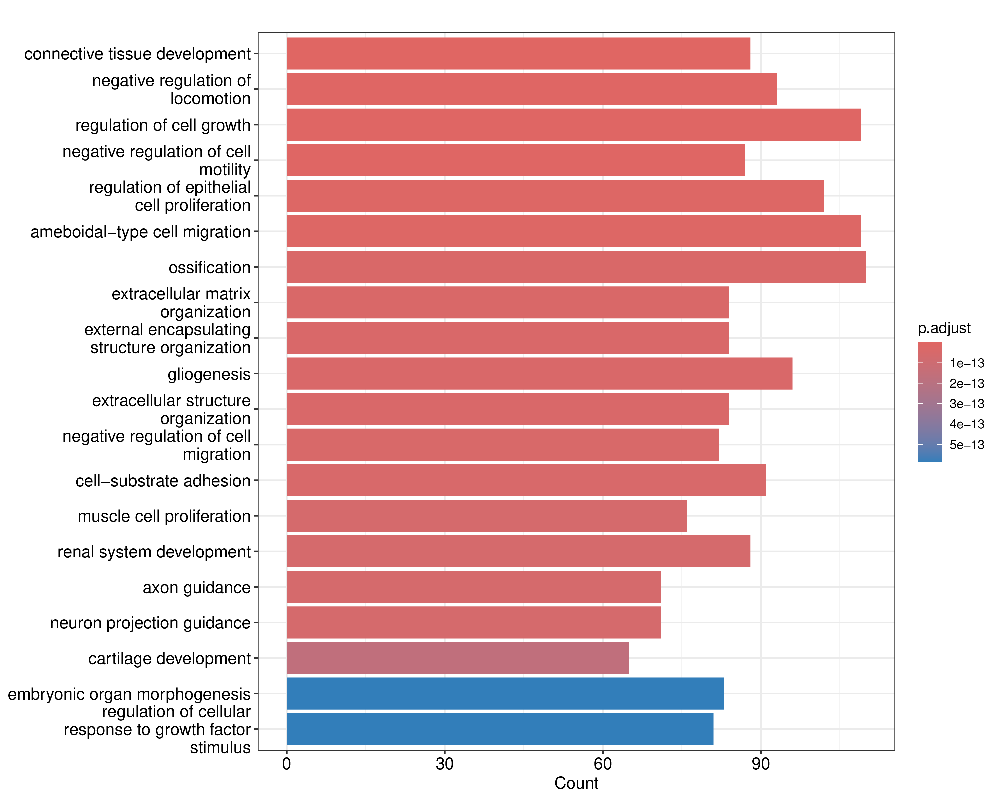
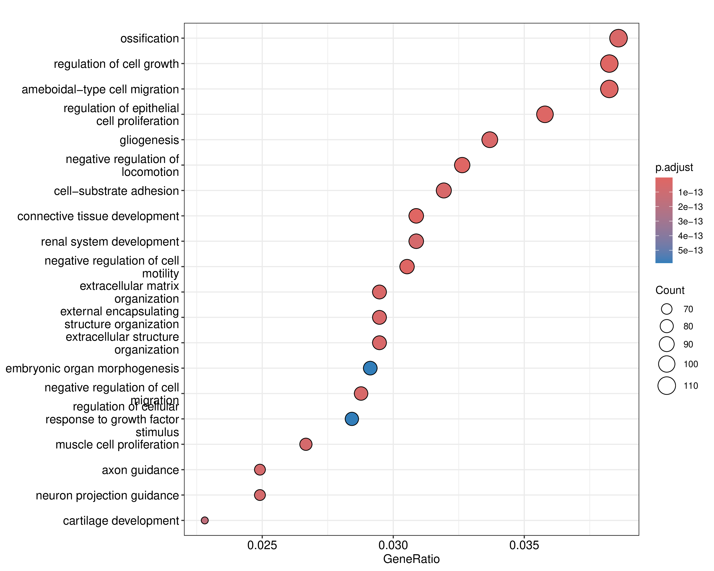
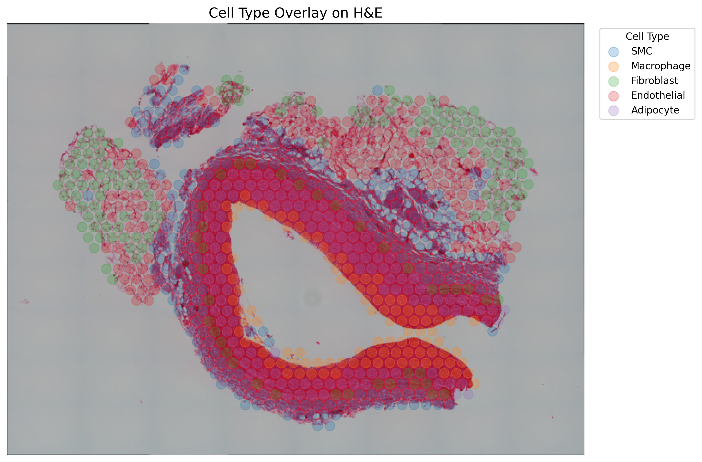
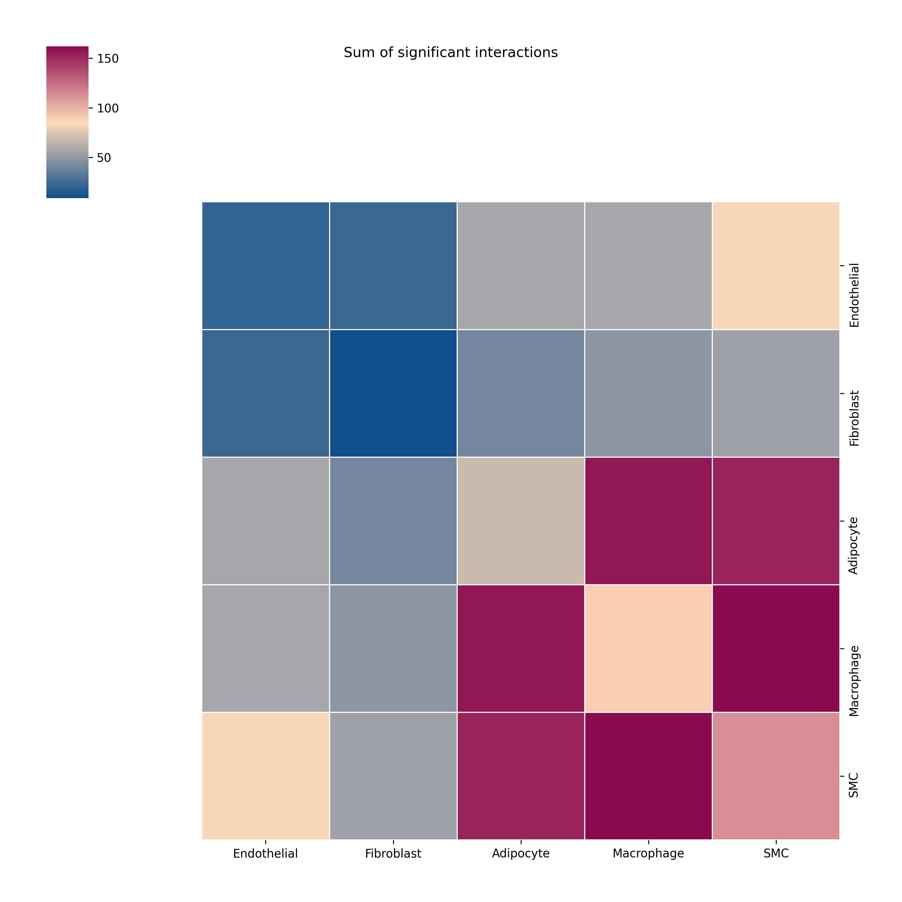

# RNA Seq Analysis for Dr.Wang's Lab
[](https://opensource.org/licenses/MIT)

## Required tools and applications

#### Install sratoolkit

```bash
wget https://ftp-trace.ncbi.nlm.nih.gov/sra/sdk/3.2.1/sratoolkit.3.2.1-ubuntu64.tar.gz
tar -xvzf sratoolkit.current-ubuntu64.tar.gz
cd sratoolkit.*
export PATH=$PATH:$(pwd)/bin
```

#### Install hisat2

```bash
wget https://cloud.biohpc.swmed.edu/index.php/s/oTtGWbWjaxsQ2Ho/download
unzip hisat2-2.2.0-Linux.zip
cd hisat2-2.2.0
export PATH=$PATH:$(pwd)
hisat2 --version
```

#### Install Subread

```bash
wget https://sourceforge.net/projects/subread/files/subread-2.1.0/subread-2.1.0-Linux-x86_64.tar.gz
tar -xvzf subread-2.1.0-Linux-x86_64.tar.gz
cd subread-2.1.0-Linux-x86_64
export PATH=$PATH:$(pwd)/bin
```

## Q1 Deferential Expression & Gene Ontology

A modular and reproducible pipeline for RNA-seq data analysis, designed to be deployed on high-performance computing (HPC) environments with customizable R installations.

### Overview

The pipeline supports:
- Alignment of RNA-seq reads to a reference genome
- Gene-level quantification
- Differential gene expression analysis using the edgeR package
- Functional enrichment analysis using Gene Ontology (GO) with clusterProfiler

### Step-by-step instructions to fetch data and perform Differential Expression & Gene Ontology

#### Source the environment setup script

```bash
source ./Tools/load_paths_and_test_tools.sh
```

#### Prep R

```bash
set_r_version 4.3.2
export LD_LIBRARY_PATH=/gpfs/fs7/aafc/phenocart/PhenomicsProjects/UFPSGPSCProject/4_Assets/R/icu/lib:$LD_LIBRARY_PATH
Rscript --version
```
#### Fetch data
https://www.ncbi.nlm.nih.gov/bioproject/?term=PRJNA716327

```bash
prefetch SRR14055933 --output-directory .
prefetch SRR14055935 --output-directory .
prefetch SRR14055934 --output-directory .
prefetch SRR14055936 --output-directory .
```
#### Convert SRA to FASTQ

```bash
fasterq-dump SAMN18442667
fasterq-dump SAMN18442665
fasterq-dump SAMN18442666
fasterq-dump SAMN18442664
```

#### Steps to Build HISAT2 Index for mm39 (GRCm39)

```bash
wget ftp://ftp.ensembl.org/pub/release-111/fasta/mus_musculus/dna/Mus_musculus.GRCm39.dna.primary_assembly.fa.gz
gunzip Mus_musculus.GRCm39.dna.primary_assembly.fa.gz
mkdir -p mm39_index
hisat2-build Mus_musculus.GRCm39.dna.primary_assembly.fa mm39_index/mm39
```

#### Align them to the reference genome

```bash
hisat2 -x mm39_index/mm39 -1 SAMN18442667_1.fastq -2 SAMN18442667_2.fastq -S SAMN18442667.sam
hisat2 -x mm39_index/mm39 -1 SAMN18442665_1.fastq -2 SAMN18442665_2.fastq -S SAMN18442665.sam
hisat2 -x mm39_index/mm39 -1 SAMN18442666_1.fastq -2 SAMN18442666_2.fastq -S SAMN18442666.sam
hisat2 -x mm39_index/mm39 -1 SAMN18442664_1.fastq -2 SAMN18442664_2.fastq -S SAMN18442664.sam
```

#### Convert SAM to BAM

```bash
samtools view -bS SAMN18442667.sam | samtools sort -o SAMN18442667.sorted.bam
samtools index SAMN18442667.sorted.bam
samtools view -bS SAMN18442665.sam | samtools sort -o SAMN18442665.sorted.bam
samtools index SAMN18442665.sorted.bam
samtools view -bS SAMN18442666.sam | samtools sort -o SAMN18442666.sorted.bam
samtools index SAMN18442666.sorted.bam
samtools view -bS SAMN18442664.sam | samtools sort -o SAMN18442664.sorted.bam
samtools index SAMN18442664.sorted.bam
```

#### Download genome build

```bash
wget https://ftp.ebi.ac.uk/pub/databases/gencode/Gencode_mouse/release_M33/gencode.vM33.annotation.gtf.gz
gunzip gencode.vM33.annotation.gtf.gz
```

#### Generate count matrix

```bash
featureCounts -p -T 8 -t exon -g gene_id -a annotation.gtf -o counts.txt *.sorted.bam
```
#### Run the Script

```bash
Rscript DE_GO/Q1.R
```

#### Convert pdf to png for git

```bash
convert -density 300 go_barplot.pdf -quality 300 go_barplot.png
convert -density 300 go_dotplot.pdf -quality 300 go_dotplot.png
```

### Results

### Figure 1: Bar Plot

*Bar plot of top enriched GO biological processes. Bar length indicates the number of genes associated with each term. Color gradient reflects the adjusted p-value (`p.adjust`).*

### Figure 2: Dot Plot

*Dot plot showing enriched GO terms. Dot size represents gene count, and the x-axis reflects the GeneRatio. Color scale represents adjusted p-values (`p.adjust`).*

## Q2 Trajectory Analysis

### Step-by-step instructions to fetch data and perform Trajectory Analysis

#### Source the environment setup script

```bash
source ./Tools/load_paths_and_test_tools.sh
```

#### Prep R

```bash
set_r_version 4.3.2
export LD_LIBRARY_PATH=/gpfs/fs7/aafc/phenocart/PhenomicsProjects/UFPSGPSCProject/4_Assets/R/icu/lib:$LD_LIBRARY_PATH
Rscript --version
```

#### Fetch raw SRA data

```bash
mkdir -p data/raw_sra
cd data/raw_sra

while read SRR; do
  echo "Prefetching $SRR"
  prefetch --output-directory . "$SRR"
done < ../../data/raw_sra/sra_list.txt
```

#### Extract fastq

```bash
mkdir -p data/raw_sra
cd data/raw_sra

while read SRR; do
  echo "Prefetching $SRR"
  prefetch --output-directory . "$SRR"
done < ../../data/raw_sra/sra_list.txt
```

#### Quality control

```bash
mkdir -p data/qc/fastqc
fastqc data/fastq/*_2.fastq -o data/qc/fastqc

dcd data/qc/fastqc
multiqc . -o ../multiqc
```

#### Build reference & Index

```bash
mkdir -p data/reference
cd data/reference

# Genome FASTA and GTF annotation
gwget ftp://ftp.ensembl.org/pub/release-110/fasta/mus_musculus/dna/Mus_musculus.GRCm39.dna.primary_assembly.fa.gz
gunzip Mus_musculus.GRCm39.dna.primary_assembly.fa.gz
wget ftp://ftp.ensembl.org/pub/release-110/gtf/mus_musculus/Mus_musculus.GRCm39.110.gtf.gz
gunzip Mus_musculus.GRCm39.110.gtf.gz

# Build HISAT2 index
mkdir -p ../hisat2_index
hisat2-build \
  Mus_musculus.GRCm39.dna.primary_assembly.fa \
  ../hisat2_index/mouse_index
```

#### Align reads

```bash
mkdir -p data/reference
cd data/reference

# Genome FASTA and GTF annotation
gwget ftp://ftp.ensembl.org/pub/release-110/fasta/mus_musculus/dna/Mus_musculus.GRCm39.dna.primary_assembly.fa.gz
gunzip Mus_musculus.GRCm39.dna.primary_assembly.fa.gz
wget ftp://ftp.ensembl.org/pub/release-110/gtf/mus_musculus/Mus_musculus.GRCm39.110.gtf.gz
gunzip Mus_musculus.GRCm39.110.gtf.gz

# Build HISAT2 index
mkdir -p ../hisat2_index
hisat2-build \
  Mus_musculus.GRCm39.dna.primary_assembly.fa \
  ../hisat2_index/mouse_index
```

#### Generate count matrix

```bash
mkdir -p data/counts
featureCounts -T 8 \
  -a data/reference/Mus_musculus.GRCm39.110.gtf \
  -o data/counts/feature_counts.txt \
  data/alignments/*_sorted.bam
```

#### Run the Script

```bash
Rscript TA/Q2.R
```

### Results

### Figure 3: Pseudotime Distribution

*Histogram of Slingshot pseudotime values for all cells. The x‑axis shows pseudotime (0 = earliest, ~140 = latest), and the y‑axis shows cell counts per bin, illustrating that cells are evenly distributed along the inferred trajectory.*

### Figure 4: Slingshot Trajectory on PCA

*Scatterplot of PC1 vs. PC2 for each cell, colored by cluster assignment (Set3 palette), with the Slingshot‐inferred developmental trajectory overlaid as a black curve. The curve traces the progression from progenitor to mature cell states in principal‐component space.*

### Figure 5: UMAP Colored by Pseudotime

*UMAP embedding of all cells, colored on a continuous blue–yellow scale by their Slingshot pseudotime values. Early pseudotime cells (blue) transition smoothly through intermediate (green) to late pseudotime cells (yellow), confirming the continuity of the developmental trajectory.*

## Q3 Spatial Transcriptomics & Cell-Cell Communication

A streamlined and modular pipeline for analyzing spatial transcriptomics (ST) data with cluster-based cell type annotation and downstream ligand–receptor interaction analysis, suitable for deployment on HPC environments and reproducible research workflows.

### Overview

The pipeline supports:

- Data loading and preprocessing of Visium spatial transcriptomics datasets using Scanpy
- Dimensionality reduction and unsupervised clustering (PCA, neighbor graph, Leiden algorithm)
- Manual annotation of clusters to biological cell types based on domain knowledge
- Visualization of spatial cell types overlaid on H&E tissue sections
- Export of expression matrix and metadata (counts.txt and meta.txt) for downstream tools
- Inference of cell-cell communication using CellPhoneDB with statistical permutation analysis
- Heatmap visualization of significant ligand–receptor interactions with ktplotspy

### Required tools and applications

#### Python package dependencies

```bash
pip install scanpy pandas matplotlib numpy pillow cellphonedb
```

There were some issues installing ktplotspy, clone repo and install

```bash
git clone git://github.com/zktuong/ktplotspy.git
cd ktplotspy
pip install --force-reinstall .
```

### Step-by-step instructions

#### Fetch data

```bash
wget https://ftp.ncbi.nlm.nih.gov/geo/series/GSE283nnn/GSE283269/suppl/GSE283269_RAW.tar
tar -xvf GSE283269_RAW.tar
```

#### Extract and preprocess data

```bash
mkdir -p sample1a1/spatial
cp GSM8658911_sample1a1_filtered_feature_bc_matrix.h5 sample1a1/
cp GSM8658911_sample1a1_tissue_positions.csv.gz sample1a1/spatial/
cp GSM8658911_sample1a1_scalefactors_json.json.gz sample1a1/spatial/
cp GSM8658911_sample1a1_tissue_lowres_image.png.gz sample1a1/spatial/

gunzip sample1a1/spatial/*.gz
tail -n +2 sample1a1/spatial/tissue_positions_list.csv > tmp.csv && mv tmp.csv sample1a1/spatial/tissue_positions_list.csv #have to get rid of headers
```

#### Activate Python environment

```bash
source venv/bin/activate
```

#### Run the Script

```bash
python ST_CCC/Process.py
python ST_CCC/Q3.py
```

### Results

### Figure 6: Cell Type Spatial Overlay

*Cell type annotation overlaid on H&E-stained tissue section. Each spot is colored by the assigned cell type after Leiden clustering. The spatial layout preserves tissue architecture and reveals distinct cell-type localization.*

### Figure 7: Cell-Cell Communication Heatmap

*Heatmap showing the sum of significant ligand–receptor interactions between annotated cell types as inferred by CellPhoneDB. Color intensity reflects interaction strength, with diagonal values representing intra-cell-type signaling.*
